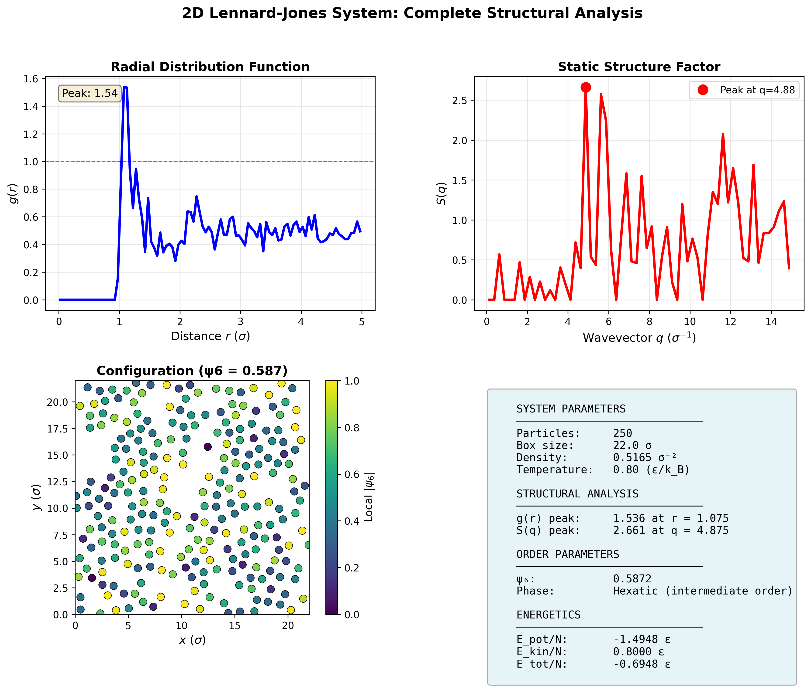
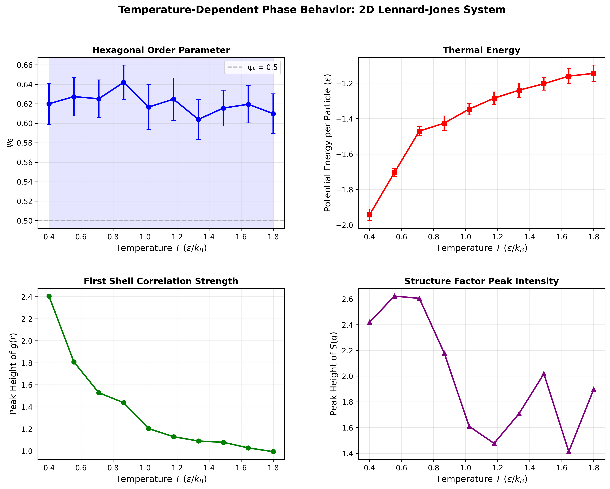

# 2D Lennard-Jones Molecular Dynamics Simulation

## Overview

This project implements a 2D Lennard-Jones molecular dynamics simulation with structural analysis tools for studying ordering and temperature-dependent behavior in interacting particle systems.

## Example Results

### Structural Analysis at a Single Temperature



The figure shows the radial distribution function g(r), static structure factor S(q), bond-orientational order parameter ψ₆, and the particle configuration for a representative temperature.

### Temperature-Dependent Structural Behavior



The temperature sweep tracks the hexagonal order parameter ψ₆, first-shell peak height of g(r), static structure factor peak intensity, and average potential energy per particle.

## Physical System

### Model Description

The system consists of **N particles** interacting via the Lennard-Jones (LJ) potential in a 2D periodic box:

```
U(r) = 4ε[(σ/r)¹² - (σ/r)⁶]
```

where:

- **ε** (epsilon): energy parameter controlling interaction strength
- **σ** (sigma): characteristic length scale (particle diameter)
- **r**: interparticle distance

### Reduced Units

All quantities are expressed in reduced units:

- Length: units of σ
- Energy: units of ε
- Temperature: T\* = k_B T / ε
- Time: τ = √(mσ²/ε)
- Mass: m = 1.0 (particle mass)

### Dynamics

The system evolves according to Newton's equations of motion using:

- **Velocity Verlet integration**: symplectic, time-reversible integrator
- **Periodic boundary conditions**: minimum image convention
- **Cell-list algorithm**: O(N) force calculation efficiency
- **Velocity rescaling thermostat**: maintains target temperature (Berendsen-like)

## Structural Analysis

The following quantities are implemented:

- Radial distribution function g(r)
- Static structure factor S(q)
- Bond-orientational order parameter ψ₆
- Temperature-dependent structural analysis

## Module Structure

```
simulation.py    - Core MD engine (Verlet integration, LJ forces)
structure.py     - Structural analysis (g(r), S(q), ψ₆)
analysis.py      - Temperature-dependent structural analysis
plotting.py      - Visualization utilities
main.py - Example demonstrations
```

## Installation

### Requirements

- Python 3.8+
- NumPy
- SciPy
- Matplotlib
- tqdm (for progress bars)

### Quick Start

```bash
pip install numpy scipy matplotlib tqdm
python main.py
```

## Usage Examples

### Example 1: Basic Structural Analysis

```python
from simulation import MDSimulation
from structure import StructureAnalyzer
from plotting import plot_combined_structure

# Initialize system
sim = MDSimulation(num_particles=300, box_size=25.0, temperature=1.0)

# Equilibrate
for _ in range(1000):
    sim.run_step()

# Analyze structure
analyzer = StructureAnalyzer(sim.positions, sim.box_size)
r, g_r = analyzer.radial_distribution_function()
q, S_q = analyzer.static_structure_factor()
psi6, _ = analyzer.bond_orientational_order_psi6()

# Visualize
plot_combined_structure(r, g_r, q, S_q, psi6=psi6)
```

### Example 2: Temperature Sweep

```python
from analysis import TemperatureSweep
from plotting import plot_temperature_sweep
import numpy as np

# Define temperature range
temperatures = np.linspace(0.3, 2.0, 15)

# Run sweep
sweep = TemperatureSweep(
    num_particles=200,
    box_size=20.0,
    temperatures=temperatures
)
results = sweep.run_sweep()

# Visualize phase behavior
plot_temperature_sweep(results, filename="phase_diagram.png")
```
